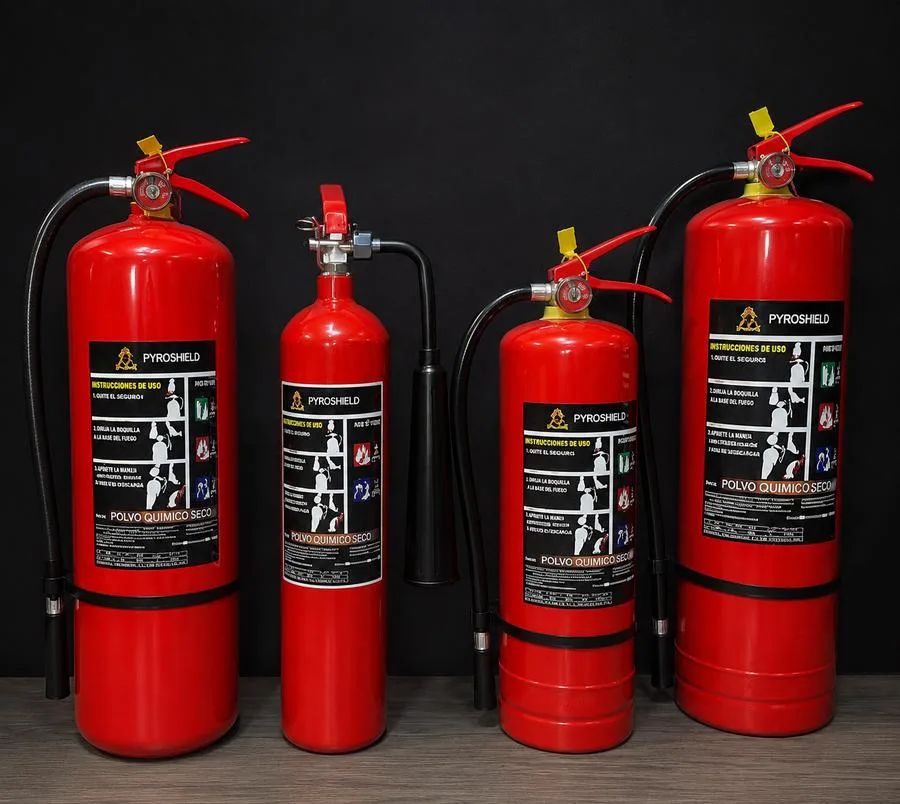
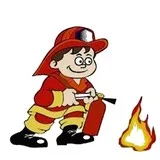

# PROCESO PÁGINA WEB — PREVIFUEGO / PYROSHIELD
**Documentación técnica completa del sitio web previfuego.com.ec**
**Última actualización: Julio 2026**

---

## ÍNDICE

1. [Información general del proyecto](#1-información-general-del-proyecto)
2. [Estructura de archivos del repositorio](#2-estructura-de-archivos-del-repositorio)
3. [Head y metadatos SEO](#3-head-y-metadatos-seo)
4. [Variables CSS raíz](#4-variables-css-raíz)
5. [Componentes y secciones — HTML completo](#5-componentes-y-secciones--html-completo)
6. [Sistema de estilos CSS — detalle completo](#6-sistema-de-estilos-css--detalle-completo)
7. [Intro cinematográfica 3D (cine-wrapper)](#7-intro-cinematográfica-3d-cine-wrapper)
8. [Sección Hero](#8-sección-hero)
9. [Galería de trabajos](#9-galería-de-trabajos)
10. [Sección Servicios](#10-sección-servicios)
11. [Tipos de fuego](#11-tipos-de-fuego)
12. [Sección Ventajas](#12-sección-ventajas)
13. [Comparativa vs competencia](#13-comparativa-vs-competencia)
14. [Productos Pyroshield](#14-productos-pyroshield)
15. [Cobertura geográfica](#15-cobertura-geográfica)
16. [Proceso de trabajo (4 pasos)](#16-proceso-de-trabajo-4-pasos)
17. [Clientes y sectores](#17-clientes-y-sectores)
18. [Banda de logos de clientes](#18-banda-de-logos-de-clientes)
19. [CTA central](#19-cta-central)
20. [Sección Contacto](#20-sección-contacto)
21. [Calculadoras NFPA](#21-calculadoras-nfpa)
22. [Footer](#22-footer)
23. [WhatsApp flotante](#23-whatsapp-flotante)
24. [Ticker informativo](#24-ticker-informativo)
25. [Navegación principal](#25-navegación-principal)
26. [Menú móvil](#26-menú-móvil)
27. [JavaScript — script.js](#27-javascript--scriptjs)
28. [JavaScript inline — index.html](#28-javascript-inline--indexhtml)
29. [Bibliotecas externas cargadas](#29-bibliotecas-externas-cargadas)
30. [Google Analytics y Google Ads](#30-google-analytics-y-google-ads)
31. [Schema.org (JSON-LD)](#31-schemaorg-json-ld)
32. [Responsive design y breakpoints](#32-responsive-design-y-breakpoints)
33. [Accesibilidad y motion](#33-accesibilidad-y-motion)
34. [Imágenes y assets](#34-imágenes-y-assets)
35. [Datos de contacto y negocio](#35-datos-de-contacto-y-negocio)
36. [Historial de cambios relevantes](#36-historial-de-cambios-relevantes)

---

## 1. INFORMACIÓN GENERAL DEL PROYECTO

| Campo | Valor |
|---|---|
| Empresa | Previfuego / PyroShield |
| Dueño | Alejandro López (alejosl0801@gmail.com) |
| Dominio | previfuego.com.ec |
| Hosting | GitHub Pages (rama `main`) |
| Repositorio | alejosl0801/previfuego-web |
| Ciudad | Guayaquil, Ecuador |
| RUC | 0952773976001 |
| Teléfono principal | +593 98 358 3325 |
| Teléfono secundario | +593 97 899 7247 |
| Correo | ventas_previfuego@hotmail.com |
| Dirección | Portete #3007 y Gallegos Lara, Guayaquil |
| Horario | Lunes a Viernes 8:00 — 17:00 |
| Instagram | @PYROSHIELD_GYE |
| Facebook | /previfuego |

**Descripción del negocio:**
Empresa de seguridad industrial y contra incendios con más de 25 años en el mercado. Venta, recarga y mantenimiento de extintores, instalación de sistemas contra incendios (rociadores, CO₂, bombas), detección de humo, capacitaciones y señaléticas. Distribuidores de la línea PyroShield. Clientes activos: 400+. Extintores trabajados en 2025: 2,400+.

---

## 2. ESTRUCTURA DE ARCHIVOS DEL REPOSITORIO

```
previfuego-web/
├── index.html                    ← Archivo principal — toda la página
├── script.js                     ← Lógica JS: carruseles, galería, calculadoras, contadores
├── anuncio-empleo.html           ← Anuncio vacante chofer (generado Julio 2026)
├── proceso-pagina-web.md         ← Este documento
├── clientes.md                   ← Registro de clientes (The Point, Corporal Gym, etc.)
├── contexto_negocio.md           ← Contexto del negocio para sesión local
├── img/
│   ├── logo-previfuego.jpg/.webp
│   ├── logo-pyroshield.jpg/.webp
│   ├── hero-extintores.jpg/.webp
│   ├── EXTINTORES PORTATILES.webp
│   ├── EXTINTORES RODANTES DE CO2.webp
│   ├── EXTINTORES RODANTES DE PQS 50-100-150LBS.webp
│   ├── EXTINTORES DE ACERO INOXIDABLE PARA H20, ACETATO DE POTASIO, FOAM.webp
│   ├── CABEZALES IMPORTADOS DE BRONCE.webp
│   ├── MANGUERAS PARA GABINETES CONTRA INCENDIOS 15 MTRS.webp
│   ├── MANGUERAS PARA GABINETES CONTRA INCENDIOS 30 MTRS.webp
│   ├── VALVULAS PARA GABINETES CONTRA INCENDIOS.webp
│   ├── ACCESORIOS PARA GABINETES CONTRA INCENDIOS.webp
│   └── ACCESORIOS PARA MANGUERAS CONTRA INCENDIOS.webp
├── sist co2/
│   ├── co2-01.webp a co2-19.webp  (18 fotos de sistemas CO₂)
├── extintores/
│   ├── ext-01.webp a ext-28.webp  (27 fotos de extintores)
│   ├── cargando extitores co2.webp
│   ├── instalacion.webp/.jpg
│   └── para edificios coporativos.jpg/.webp
├── rociadores y tuberias ci/
│   ├── roc-01.webp a roc-17.webp  (11 fotos de rociadores)
├── bombas ci/
│   ├── bom-01.webp a bom-09.webp  (9 fotos de bombas)
├── capacitaciones/
│   ├── cap-01.webp a cap-13.webp  (12 fotos de capacitaciones)
├── sistemas deteccion de humo/
│   ├── det-01.webp a det-10.webp  (10 fotos de detección)
└── img/cine/story/
    ├── s01-detector-sirena-viga.jpg
    ├── s02-red-rociadores-techo.jpg
    ├── s03-instalacion-tuberia.jpg
    ├── s04-descarga-co2-nube.jpg
    ├── s05-practica-extintor-nube.jpg
    ├── s06-lote-extintores-recarga.jpg
    ├── s07-extintores-bodega.jpg
    ├── s08-tanque-gigante-bombas.jpg
    ├── s09-sala-bombas-moderna.jpg
    ├── s10-cilindros-previfuego.jpg
    ├── s11-cilindro-co2-senaletica.jpg
    ├── s12-cocina-industrial.jpg
    ├── s13-equipo-restaurante-1.jpg
    └── s14-equipo-restaurante-2.jpg
```

---

## 3. HEAD Y METADATOS SEO

### Redirección HTTPS (primera línea del head)
```html
<script>if(location.protocol!=='https:'&&location.hostname!=='localhost')location.replace('https://'+location.host+location.pathname+location.search);</script>
```
Fuerza HTTPS en cualquier acceso HTTP. Se ejecuta antes de cualquier otra cosa.

### Meta tags principales
```html
<meta charset="UTF-8">
<meta name="viewport" content="width=device-width,initial-scale=1.0">
<meta http-equiv="Cache-Control" content="no-cache, no-store, must-revalidate">
<meta http-equiv="Pragma" content="no-cache">
<meta http-equiv="Expires" content="0">
```

### Meta descripción y keywords SEO
```
Título: Extintores Guayaquil · Recarga y Mantenimiento | Previfuego
Descripción: Recarga y mantenimiento de extintores en Guayaquil. Sistemas CO₂, rociadores y detección de humo. +25 años · Certificados NFPA · Inspección gratuita · Cotiza ahora.
Keywords: extintores guayaquil, recarga extintores guayaquil, mantenimiento extintores guayaquil, sistemas contra incendios guayaquil, recarga co2 guayaquil, rociadores contra incendios, deteccion de humo guayaquil, inspeccion bomberos guayaquil, certificado nfpa ecuador, previfuego
Robots: index, follow
Canonical: https://previfuego.com.ec/
Theme-color: #B22222
```

### Open Graph (redes sociales)
```
og:title    → Extintores Guayaquil · Recarga y Mantenimiento | Previfuego
og:description → Recarga y mantenimiento de extintores, sistemas CO₂, rociadores y detección de humo. Más de 25 años en Guayaquil. Certificados NFPA. Los precios más bajos.
og:type     → website
og:url      → https://previfuego.com.ec/
og:image    → https://previfuego.com.ec/img/hero-extintores.jpg
```

### Twitter Card
```
twitter:card        → summary_large_image
twitter:title       → Previfuego — Protección contra incendios Guayaquil
twitter:description → Extintores, sistemas CO₂, rociadores y más. +25 años. Certificados NFPA.
```

### Favicon
```html
<link rel="icon" href="img/logo-previfuego.jpg" type="image/jpeg">
```

---

## 4. VARIABLES CSS RAÍZ

```css
:root {
  --r:  #B22222;   /* rojo principal */
  --r2: #8B1A1A;   /* rojo oscuro (hover) */
  --r3: #CC3300;   /* rojo intermedio */
  --ng: #1C1C1A;   /* negro suave (texto principal) */
  --g:  #5a5a5a;   /* gris medio (textos secundarios) */
  --lg: #f7f7f5;   /* gris claro (fondos de secciones alternas) */
  --bo: #e5e5e2;   /* borde (líneas divisoras) */
}
```

---

## 5. COMPONENTES Y SECCIONES — HTML COMPLETO

El `index.html` tiene **1,971 líneas**. Las secciones en orden de aparición son:

1. `<head>` — metadatos, CSS, GA, Schema (líneas 1–742)
2. `<body>` → WhatsApp flotante (líneas 744–766)
3. Ticker de noticias (líneas 768–788)
4. Navegación principal (líneas 790–812)
5. Menú móvil (líneas 814–825)
6. SVG filtro de calor (lines 828–835)
7. Intro cinematográfica `#cine-wrapper` (líneas 836–882)
8. Hero `#hero` (líneas 883–917)
9. Stats bar (líneas 919–928)
10. Galería `#galeria` (líneas 930–940)
11. Lightbox (línea 940)
12. Alerta Bomberos + Servicios `#servicios` (líneas 941–968)
13. Tipos de fuego (líneas 970–989)
14. Ventajas `#ventajas` (líneas 991–1007)
15. Comparativa `#comparativa` (líneas 1009–1039)
16. Productos Pyroshield `#productos` (líneas 1040–1068)
17. Cobertura `#cobertura` (líneas 1070–1088)
18. Proceso `#proceso` (líneas 1090–1106)
19. Clientes `#clientes` (líneas 1108–1199)
20. Banda de logos (líneas 1201–1247)
21. CTA (líneas 1249–1259)
22. Contacto `#contacto` (líneas 1261–1276)
23. Calculadora `#calculadora` (líneas 1278–1404)
24. Footer (líneas 1406–1436)
25. JavaScript inline (líneas 1438–1498)
26. CDNs externos (líneas 1499–1501)
27. Motor cinematográfico JS (líneas 1502–1820)
28. Motor hero JS + GSAP (líneas 1821–1970)

---

## 6. SISTEMA DE ESTILOS CSS — DETALLE COMPLETO

### Reset global
```css
* { margin:0; padding:0; box-sizing:border-box; }
html { scroll-behavior: smooth; }
body { overflow-x: hidden; font-family: -apple-system, BlinkMacSystemFont, 'Segoe UI', sans-serif; color: var(--ng); background: #fff; }
a { text-decoration: none; color: inherit; }
img { max-width: 100%; display: block; }
```

### Ticker `.ticker`
- Fondo: gradiente lineal oscuro `#4A0A0A → #8B1A1A → #6B0F0F → #8B1A1A → #4A0A0A`
- Borde inferior: `rgba(200,50,50,.3)`
- Padding: `8px 0`
- Animación: `ticker 30s linear infinite` → `translateX(-50%)`
- Ítems: `font-size:13px`, `font-weight:600`, `color:#fff`, `padding:0 32px`
- Separador entre ítems: `::after { content:'•'; margin-left:32px; opacity:.5 }`

### Navegación `.nav`
- Fondo: `#fff`, `border-bottom: 1px solid var(--bo)`
- `position: sticky; top: 0; z-index: 100`
- `box-shadow: 0 2px 12px rgba(0,0,0,.06)`
- Altura: `70px` (escritorio), `60px` (móvil ≤700px)
- Max-width contenido: `1120px`
- Logo `.nli`: `52×52px`, `border-radius:10px`, fondo `#1a1a1a`
- Nombre `.nlt`: `22px`, `font-weight:800`, `color:var(--r)`
- Subtítulo `.nls`: `11px`, `color:var(--g)`
- Links `.nm a`: `13px`, `font-weight:600`, `color:var(--ng)` → hover `color:var(--r)`
- Botón cotización `.nct`: gradiente rojo, `padding:10px 20px`, `border-radius:8px`, `font-size:14px`
- Menú oculto en ≤900px: `.nm { display:none }`

### Hamburguesa `.hbg`
- Oculto en escritorio, visible en ≤900px
- 3 spans de `22×2px`
- Animación `open`: span1 rota +45°, span2 desaparece, span3 rota -45°

### Menú móvil `.mob-menu`
- `position:fixed; inset:0; top:70px; background:#fff; z-index:99`
- Cada link: `font-size:17px; font-weight:700; padding:14px 0; border-bottom:1px solid var(--bo)`
- Flecha decorativa: `::after { content:'→'; opacity:.3 }`
- CTA: gradiente rojo, `padding:16px`, `border-radius:12px`

### Hero `.hero`
- `position:relative; min-height:92vh; background:#030000; overflow:hidden`
- Grid: `grid-template-columns: 1.1fr 0.9fr; gap:60px` (escritorio)
- 1 columna en ≤900px, imagen oculta
- Fondo `.hero-bg`: `z-index:0; opacity:.15; filter:blur(1px)`
- Overlay `.hero-ov`: gradiente 135° desde `rgba(3,0,0,.97)` a `rgba(8,2,0,.8)`
- Canvas `.#hero-canvas`: `z-index:2; pointer-events:none; opacity:.9`
- Glow `.hero-glow`: `z-index:3; radial-gradient` de fuego desde abajo-izquierda y abajo-derecha
- Contenido `.hero-c`: `z-index:4; max-width:1120px; padding:80px 24px`
- Badge `.rg-badge`: fondo blanco, borde rojo suave, punto verde pulsante (WhatsApp online)
- Tag `.hero-tag`: fondo `rgba(150,20,20,.2)`, borde `rgba(180,30,30,.4)`, color `#E87070`
- H1 `.hero h1`: `font-size:clamp(38px,4.8vw,60px); font-weight:800; letter-spacing:-2px`
- `.hero-accent`: `color:#E85A5A; text-shadow` naranja/rojo (palabras destacadas del h1)
- Slogan `.slogan`: `18px; font-style:italic; color:rgba(255,255,255,.55)`
- Párrafo: `17px; color:rgba(255,255,255,.65); line-height:1.82`
- Botón principal `.btn-main`: gradiente `#CC2200 → #8B1010 → #5C0A0A`, `padding:15px 32px`, `border-radius:10px`
- Botón fantasma `.btn-ghost`: `background:rgba(255,255,255,.06); border:rgba(255,255,255,.18)`
- Stats `.hstat-n`: `38px; font-weight:800; color:#fff`
- Imagen hero `.hero-img`: `border-radius:20px; mix-blend-mode:luminosity; opacity:.9`
- Badge inferior `.hbadge`: fondo blanco, `border-radius:16px`, `box-shadow:0 8px 32px rgba(0,0,0,.15)`
- Sello `.hero-seal`: círculo rojo 80×80px, posición `top:-18px; right:-18px`
- Animación flotante imagen: `@keyframes heroFloat` ±10px cada 6s (solo desktop activo)

### Stats bar `.stats-bar`
- Grid de 5 columnas (1120px max)
- Cada stat `.si-n`: `30px; font-weight:800; background:gradient #D44000→#8B1A1A; -webkit-text-fill-color:transparent`
- 2 columnas en ≤700px

### Galería `.gal-sec`
- Fondo: `var(--lg)`, padding `70px 24px`
- Filtros `.gal-cat-btn`: botones pill, activo con gradiente rojo
- Grid categorías: `grid-template-columns: repeat(2,1fr); gap:32px`
- 1 columna en ≤700px
- `.gal-group`: oculto por defecto, visible con clase `.visible`

### Carrusel `.carr`
- `border-radius:18px; overflow:hidden; background:#111`
- `aspect-ratio:5/4`
- Track: `display:flex; transition:transform .42s cubic-bezier(.4,0,.2,1)`
- Cada slide: `flex:0 0 100%; position:relative; overflow:hidden`
- Imagen: `width:100%; height:100%; object-fit:cover; cursor:zoom-in`
- Overlay: gradiente `to top, rgba(0,0,0,.65) → transparent`
- Caption: `bottom:16px; left:18px; right:60px; color:#fff; font-size:13px; font-weight:600`
- Contador: `top:14px; right:14px; background:rgba(0,0,0,.5); backdrop-filter:blur(6px)`
- Botones `◄ ►`: `40×40px; border-radius:50%; background:rgba(0,0,0,.45); backdrop-filter:blur(4px)` → hover `rgba(180,20,20,.8)`
- Dots: `7×7px; border-radius:50%; background:var(--bo)` → activo `var(--r); scale:1.35`

### Lightbox `.lb`
- `display:none; position:fixed; inset:0; background:rgba(0,0,0,.95); z-index:9999`
- Imagen: `max-width:94vw; max-height:90vh; border-radius:12px; object-fit:contain`
- Botón cerrar: `position:fixed; top:16px; right:20px; color:#fff; font-size:38px`

### Servicios `.svc-grid`
- 6 columnas → 3 columnas ≤1100px → 2 columnas ≤700px → 1 columna ≤560px
- Cada card `.svc`: `border:1.5px solid var(--bo); border-radius:14px; padding:16px 12px`
- Hover: `transform:translateY(-5px); box-shadow:0 16px 48px rgba(100,0,0,.12)`
- Línea de acento inferior: `::after` gradiente rojo, `scaleX(0)` → `scaleX(1)` en hover
- Ícono `.svc-ico`: `40×40px; background:rgba(212,43,43,.07); border-radius:12px; font-size:20px`
- Tag `.svc-t`: `background:rgba(212,43,43,.07); color:var(--r); font-size:10px; border-radius:20px`

### Tipos de fuego `.fuego-grid`
- 5 columnas → 2 columnas ≤800px → 1 columna ≤500px
- Letra clase: `36px; font-weight:800; gradiente #CC3300→#8B1A1A; transparent text`
- Hover: `border-color:var(--r); transform:translateY(-3px)`

### Ventajas `.vj-grid`
- 3 columnas → 2 ≤800px → 1 ≤500px
- Cada ventaja: `border:1.5px solid var(--bo); border-radius:16px; padding:24px; display:flex; gap:14px`
- Ícono: `46×46px; background:rgba(212,43,43,.08); border-radius:12px`

### Comparativa `.comp-table`
- `width:100%; border-collapse:collapse; border-radius:16px; overflow:hidden`
- Header Previfuego: `background:gradient #fff0f0→#fff5f5; color:var(--r); border-bottom:2px solid var(--r)`
- Header competencia: `background:var(--lg); color:var(--g)`
- ✓ verde `#22c55e`, ✗ rojo `#ef4444`, ambos `font-size:18px`

### Productos PyroShield `.pyro-carr-wrap`
- Logo en cuadro negro `60×60px; border-radius:14px`
- Carrusel automático infinito: `animation:pyroslide 30s linear infinite`
- Cada producto `.pi`: `width:220px; border-radius:16px; aspect-ratio:3/4`
- Hover imagen: `transform:scale(1.06); opacity:.85`
- Label gradiente oscuro en la parte inferior

### Cobertura `.cob-grid`
- 4 columnas → 2 ≤800px
- Cada ítem: `border:1.5px solid var(--bo); border-radius:10px; padding:10px 14px`
- Hover: `border-color:var(--r); color:var(--r); transform:translateY(-2px)`

### Proceso `.p-grid`
- 4 pasos en una fila con línea de conexión horizontal `.pl`
- Cada paso `.p-dot`: `56×56px; gradiente rojo; border-radius:50%; font-size:22px`
- `.pl`: `top:27px; left:12%; right:12%; height:2px; gradiente var(--r)→#ff9090`
- 2 columnas en ≤700px (línea ocultada)

### Clientes `.sector-grid`
- `display:flex; flex-wrap:wrap; gap:14px; justify-content:center`
- Cada sector: `flex:0 0 calc(25% - 11px)`; hover con tooltip
- Tooltip `.sector-tooltip`: aparece en hover desktop, expandido con tap en móvil
- Tooltip tiene título en rojo, items con bullet rojo, arrow apuntando al sector

### Logos de clientes `.logos-track`
- `animation:logoslide 15s linear infinite`
- Fade sides con `::before ::after` gradientes a blanco
- Hover pausa animación

### CTA `.cta`
- Fondo oscuro: `linear-gradient(160deg,#020000,#0E0000,#180000,#080000)`
- Círculo decorativo: `radial-gradient` rojo, `opacity:.04`
- Horarios en 3 columnas `.hor-row`
- Botón principal full-width en móvil

### Contacto `.cont-bg`
- Fondo oscuro similar al CTA
- Grid de 3 tarjetas → 1 en ≤700px
- Cada `.cc`: `background:rgba(255,255,255,.05); border:rgba(255,255,255,.08); border-radius:18px`
- Mapa iframe: `width:100%; height:300px; border-radius:16px; filter:grayscale(.2)`

### Calculadora `.calc-wrap`
- Fondo oscuro: `linear-gradient(135deg,#1a0000,#2a0808)`
- 3 tabs con colores activos en gradiente rojo
- Campos: `background:rgba(255,255,255,.08); border:rgba(255,255,255,.15); border-radius:10px; color:#fff`
- Botón calcular: gradiente rojo, `border-radius:12px`
- Resultado: `background:rgba(255,255,255,.06); border:rgba(255,255,255,.12); border-radius:14px`
- Valores resultado `.calc-res-val`: `20px; font-weight:800; color:#E87070`

### Footer `footer`
- `background:#010000; padding:28px 24px; border-top:rgba(255,255,255,.05)`
- Nombre en rojo `.fl: 20px; font-weight:800; color:var(--r)`
- Textos secundarios `.ft`: `13px; color:rgba(255,255,255,.3)`
- FAQ dropdown inverso (aparece hacia arriba)
- Texto SEO `.fseo`: `12px; color:rgba(255,255,255,.15)` — visible solo para rastreadores

### WhatsApp flotante `.waf-wrap`
- Botón verde `62×62px; border-radius:50%; background:#25D366`
- `box-shadow:0 6px 28px rgba(37,211,102,.5); z-index:200`
- Card expandible `.waf-card`: `300px; border-radius:20px; box-shadow:0 12px 40px rgba(0,0,0,.2)`
- Header verde con logo circular, nombre, punto verde pulsante, tiempo de respuesta
- Burbuja de chat estilo WhatsApp real con triángulo de flecha
- Botón de acción verde `border-radius:12px`
- En móvil ≤700px: card se abre/cierra con tap (no hover)

### Badge respuesta `.rg-badge`
- `background:linear-gradient(135deg,#fff8f8,#fff); border:rgba(178,34,34,.2)`
- Punto verde `.rg-dot`: animación `wsppulse 2s ease-out infinite` (escala 1→1.6, opacidad 1→0)

### Contadores `.counter`
- `display:inline-block`
- Animados con `IntersectionObserver` al entrar en viewport
- Duración: 1800ms, easing: `1 - (1-t)^3` (ease-out cúbico)

---

## 7. INTRO CINEMATOGRÁFICA 3D (CINE-WRAPPER)

### Estructura HTML
```html
<div class="cine-wrapper" id="cine-wrapper">         <!-- 1300vh de altura para scroll -->
  <div class="cine-sticky" id="cine-sticky">          <!-- sticky top:0; height:100vh -->
    <video class="cine-vid" id="cine-v0" ...>         <!-- video de fondo (Pexels) intro -->
    <div class="cine-photos" id="cine-photos"></div>  <!-- 14 fotos insertadas por JS -->
    <div class="cine-bridge" id="cine-bridge"></div>  <!-- flash de transición entre tomas -->
    <canvas id="cine-canvas"></canvas>                <!-- Three.js: partículas 3D -->
    <div class="cine-godrays"></div>                  <!-- rayos de luz cónicos CSS -->
    <div class="cine-shimmer"></div>                  <!-- distorsión de calor SVG -->
    <div class="cine-flare"></div>                    <!-- destello de lente -->
    <div class="cine-vignette-pulse"></div>           <!-- viñeta que respira -->
    <div class="cine-grain"></div>                    <!-- grano de película -->

    <!-- Escena intro: "Tu negocio, protegido." -->
    <div class="cine-scene" id="cine-s0">
      <div class="cine-badge-pill">Más de 25 años en Guayaquil</div>
      <h1 class="cine-h1">Tu negocio,<br><em>protegido.</em></h1>
      <p class="cine-sub">Recarga · Mantenimiento · Sistemas contra incendios</p>
    </div>

    <!-- Subtítulos dinámicos (14 tomas) -->
    <div class="cine-story-cap" id="cine-story-cap">
      <div class="cine-label" id="cine-cap-label"></div>
      <h2 class="cine-h2" id="cine-cap-h"></h2>
      <p class="cine-sub" id="cine-cap-sub"></p>
    </div>

    <!-- Escena final con CTA -->
    <div class="cine-scene" id="cine-final">
      <div class="cine-label">Previfuego — Guayaquil</div>
      <h2 class="cine-h2">El mejor aliado<br>para tu <em>seguridad.</em></h2>
      <div class="cine-stats">
        <div><div class="cine-stat-n">25+</div><div class="cine-stat-l">Años de experiencia</div></div>
        <div><div class="cine-stat-n">2400+</div><div class="cine-stat-l">Clientes atendidos</div></div>
        <div><div class="cine-stat-n">400+</div><div class="cine-stat-l">Empresas activas</div></div>
      </div>
      <a class="cine-cta" href="https://wa.me/593983583325?...">💬 Escríbenos ahora →</a>
    </div>

    <!-- 5 dots de navegación por acto -->
    <div class="cine-dots" id="cine-dots">
      <div class="cine-dot on" data-act="intro"></div>
      <div class="cine-dot" data-act="deteccion"></div>
      <div class="cine-dot" data-act="extincion"></div>
      <div class="cine-dot" data-act="sistemas"></div>
      <div class="cine-dot" data-act="equipo"></div>
    </div>

    <!-- Hint de scroll -->
    <div class="cine-scroll" id="cine-scroll-hint">
      <span>scroll</span>
      <div class="cine-scroll-bar"></div>
    </div>

    <!-- Fade final a negro -->
    <div class="cine-fade" id="cine-fade"></div>
  </div>
</div>
```

### Las 14 fotos — STORY array (guion)

| # | Foto | Acto | Alineación | Título | Subtítulo |
|---|---|---|---|---|---|
| s01 | s01-detector-sirena-viga.jpg | deteccion | right | Sistemas de detección bajo norma NFPA 72. | Detectores de humo y estaciones de alarma con supervisión permanente del riesgo. |
| s02 | s02-red-rociadores-techo.jpg | deteccion | left | Diseño hidráulico bajo norma NFPA 13. | Cálculo hidráulico, dimensionamiento y montaje de redes de rociadores automáticos. |
| s03 | s03-instalacion-tuberia.jpg | deteccion | right | Tubería y uniones bajo especificación técnica. | Instalación ejecutada por técnicos certificados en sistemas hidráulicos contra incendio. |
| s04 | s04-descarga-co2-nube.jpg | extincion | left | Respuesta inmediata ante el primer foco de fuego. | Extintores portátiles clasificados según NFPA 10 para cada clase de riesgo. |
| s05 | s05-practica-extintor-nube.jpg | extincion | right | Formación práctica para actuar en los primeros segundos. | Simulacros de uso de extintores conforme a protocolos de brigadas contra incendio. |
| s06 | s06-lote-extintores-recarga.jpg | extincion | left | Mantenimiento preventivo según ciclo normado. | Recarga, inspección y prueba hidrostática de extintores conforme a NFPA 10. |
| s07 | s07-extintores-bodega.jpg | extincion | right | El agente correcto para cada clase de fuego. | Polvo químico seco, CO2 y agentes limpios, seleccionados según la carga de riesgo. |
| s08 | s08-tanque-gigante-bombas.jpg | sistemas | left | Capacidad calculada para la demanda del sistema. | Tanques y cisternas dimensionados según la demanda hidráulica de la red. |
| s09 | s09-sala-bombas-moderna.jpg | sistemas | right | Presión constante bajo norma NFPA 20. | Sistemas de bomba principal y bomba jockey para sostener la presión de la red. |
| s10 | s10-cilindros-previfuego.jpg | sistemas | left | Ingeniería propia, instalación certificada. | Sistemas de supresión con agentes limpios diseñados e instalados por Previfuego. |
| s11 | s11-cilindro-co2-senaletica.jpg | sistemas | right | Supresión total en áreas de riesgo especial. | Sistemas de CO2 con señalética normada y secuencia de disparo controlada. |
| s12 | s12-cocina-industrial.jpg | sistemas | left | Detección y extinción integradas bajo NFPA 96. | Sistemas certificados de supresión para cocinas y campanas industriales. |
| s13 | s13-equipo-restaurante-1.jpg | equipo | right | Formamos brigadas que saben responder. | Capacitación técnica en prevención y combate de incendios para cadenas y restaurantes. |
| s14 | s14-equipo-restaurante-2.jpg | equipo | left | 25 años de ingeniería al servicio de tu seguridad. | Diseño, instalación y mantenimiento de sistemas contra incendio bajo normativa NFPA. |

### Motor Three.js del cinematic

**Partículas:**
- **Embers** (brasas): 900 partículas, spread 9, z: 25→-45, size avg 0.35, `THREE.AdditiveBlending`, opacity 0.85
- **Sparks** (chispas): 500 partículas, spread 6, z: 25→-45, size avg 0.12, `THREE.AdditiveBlending`, opacity 0.9
- **Smoke** (humo): 220 partículas, spread 12, z: 25→-45, size avg 3.2, `THREE.NormalBlending`, opacity 0.3

**Texturas generadas en canvas:**
- `emberTex`: `glowTex('rgba(255,230,120,1)','rgba(255,110,20,0.9)')` — gradiente radial amarillo→naranja
- `smokeTex`: gradiente `rgba(90,80,80,0.5)` → `rgba(60,50,50,0.22)` → transparente

**Iluminación:**
- `THREE.PointLight(0xff5522, 2.2, 40)` — luz de fuego que parpadea
- `THREE.AmbientLight(0x220800, 0.6)` — ambiente cálido oscuro
- Parpadeo: `intensity = 2.0 + Math.sin(t*9)*0.35 + Math.sin(t*23)*0.18`

**Cámara:**
- Posición fija: `(0, 0.3, -10)`, mirando hacia `(0, 0, -40)`
- Sway de mano: `x = sin(t*0.4)*0.4`, `y = 0.3 + cos(t*0.5)*0.25`, `rotation.z = sin(t*0.25)*0.01`

**Sistema de scroll:**
```javascript
// Lee scroll directamente (ScrollTrigger roto por overflow-x:hidden)
var max = wrapper.offsetHeight - window.innerHeight;
targetProgress = (window.scrollY - wrapper.offsetTop) / max;
// Suavizado: progress += (targetProgress - progress) * 0.08
```

**Ventanas de fade por foto:**
- Cada foto tiene `window = [fadeIn-start, fadeIn-end, fadeOut-start, fadeOut-end]`
- Función `sceneAlpha(p, w)` retorna 0→1→1→0 según el progreso
- Foto dominante = la que tiene mayor alpha en cada frame

**Ken Burns por foto:**
- Escala: `z0 → z1` (ejemplo: `1.16 → 1.05`)
- Paneo X: `(0.5-lp)*px*2 + sin(t*0.13+i)*0.3`
- Paneo Y: `(0.5-lp)*py*2 + cos(t*0.1+i)*0.22`

**Efectos especiales:**
- Bridge (flash de corte): `triangle(progress, CUTS[ci], seg*0.16)` — destellos en los cortes
- God rays: `opacity:0.34` normal, `0.10` cuando el acto es `equipo` (caras humanas)
- Heat shimmer: solo durante acto `extincion`, opacity hasta `0.45`
- Lens flare: solo en tomas marcadas con `flare:{x,y}` (s01, s04, s08)
- Viñeta: `box-shadow inset` respira al ritmo de las brasas
- Fade final: cuando `progress > 0.965`, se disuelve a negro

**Escenas de texto:**
- Intro (`cine-s0`): visible en `progress ∈ [-0.01, INTRO_END (0.05)]`
- Story captions: aparece el dominante de las 14 tomas
- Final CTA: visible desde `progress > 0.95`, no desaparece nunca (window[2,3] = 2, 2.1)
- Dots de acto: muestran acto actual según progreso de scroll

**Mobile:**
```css
@media(max-width:900px) { .cine-wrapper { display:none; } }
```
Y en JS: `if(isMobile || typeof THREE==='undefined') { wrapper.style.display='none'; return; }`

---

## 8. SECCIÓN HERO

### HTML
```html
<div class="hero" id="hero">
  <div class="hero-bg" id="hero-bg" style="background-image:url('img/hero-extintores.webp');" aria-hidden="true"></div>
  <div class="hero-ov"></div>
  <canvas id="hero-canvas" aria-hidden="true"></canvas>
  <div class="hero-glow" aria-hidden="true"></div>
  <div class="hero-c">
    <div>
      <div class="rg-badge"><span class="rg-dot"></span> Respondemos en menos de 1 hora</div>
      <div class="hero-tag">🔴 Más de 25 años en Guayaquil</div>
      <h1 class="hero-h1">
        <span class="hero-line">Tu negocio seguro.</span>
        <span class="hero-line">Nosotros nos</span>
        <span class="hero-line hero-accent">encargamos de todo.</span>
      </h1>
      <div class="slogan">"El mejor aliado para tu seguridad"</div>
      <p>Recarga y mantenimiento de extintores, instalación de sistemas contra incendios, rociadores, detectores y mucho más. Atendemos todo tipo de negocio en Guayaquil, Samborondón y Daule.</p>
      <div class="hbs">
        <a class="btn-main" href="https://wa.me/593983583325?...">💬 Escribir por WhatsApp</a>
        <a class="btn-ghost" href="#servicios">Ver servicios ↓</a>
      </div>
      <div class="hstats">
        <div class="hstat">
          <div class="hstat-n"><span class="counter" data-target="25">0</span>+</div>
          <div class="hstat-l">Años en el mercado</div>
        </div>
        <div class="hstat">
          <div class="hstat-n"><span class="counter" data-target="2400">0</span>+</div>
          <div class="hstat-l">Extintores en 2025</div>
        </div>
        <div class="hstat">
          <div class="hstat-n"><span class="counter" data-target="400">0</span>+</div>
          <div class="hstat-l">Clientes activos</div>
        </div>
      </div>
    </div>
    <div class="hero-img">
      
      <div class="hbadge">
        <div style="font-size:26px;">🏆</div>
        <div><div class="hbt">Los mejores precios</div><div class="hbs2">de Guayaquil — garantizado</div></div>
      </div>
      <div class="hero-seal">
        <div class="seal-n">25+</div>
        <div class="seal-l">años en<br>el mercado</div>
      </div>
    </div>
  </div>
</div>
```

### Animación GSAP de entrada (desktop)
Secuencia de la timeline:
1. `.rg-badge` → opacity 1, y 0, 0.5s, power2.out
2. `.hero-tag` → opacity 1, y 0, 0.45s, power2.out (offset -0.22s)
3. `.hero-h1 .hero-line` (×3) → opacity 1, y 0, rotateX 0, 0.7s, stagger 0.13s, power3.out
4. `.slogan` → opacity 1, y 0, 0.45s
5. `.hero-c p` → opacity 1, y 0, 0.45s
6. `.hbs` → opacity 1, y 0, 0.45s
7. `.hstats` → opacity 1, y 0, 0.45s
8. `.hero-img` → opacity 1, x 0, scale 1, 0.85s, power3.out (desde t=0.38)
9. Al completar: llama a `runCounters()` y agrega `.float-active` a `.hero-img`

### Partículas Three.js del hero

3 grupos:
- **Embers** (80 partículas): `size:0.21, vy:0.008-0.022, opacity:0.72`, colores amarillo-naranja
- **Sparks** (120 partículas): `size:0.075, vy:0.018-0.04, opacity:0.65`, colores naranja claro
- **Glow** (50 partículas): `size:0.415, vy:0.004-0.010, opacity:0.22`, colores rojo suave

Todos con `THREE.AdditiveBlending`, `depthWrite:false`, `sizeAttenuation:true`

ScrollTrigger zoom de cámara: `z: 4.8 → 3.0`, `fov: 65° → 73°` al scrollear el hero

Parallax del background: `translateY(pp*20%)` al scrollear

### Estados iniciales CSS para animación
```css
.rg-badge, .hero-tag, .hero-h1 .hero-line, .slogan, .hero-c p, .hbs, .hstats { opacity: 0; }
.hero-img { opacity: 0; }
/* Mobile override: todo visible inmediatamente */
@media(max-width:900px) {
  .rg-badge,.hero-tag,.hero-h1 .hero-line,.slogan,.hero-c p,.hbs,.hstats,.hero-img { opacity:1!important; transform:none!important; }
}
```

---

## 9. GALERÍA DE TRABAJOS

### Categorías de filtro
| ID | Emoji | Nombre |
|---|---|---|
| all | 🔥 | Todos |
| co2 | 🔴 | Sistema CO2 |
| extintor | 🧯 | Extintores |
| sistci | 🔧 | Rociadores y Tuberías CI |
| bomba | ⚙️ | Bombas CI |
| deteccion | 🔍 | Sistemas de Detección de Humo |
| capacitacion | 🎓 | Capacitaciones |

### Carruseles y conteos de fotos

| Carrusel | ID | Fotos | Contador |
|---|---|---|---|
| Sistema CO2 | carr-co2 | 18 fotos | 1 / 18 |
| Extintores | carr-extintor | 27 fotos | 1 / 27 |
| Rociadores y Tuberías CI | carr-sistci | 11 fotos | 1 / 11 |
| Bombas CI | carr-bomba | 9 fotos | 1 / 9 |
| Sistemas de Detección de Humo | carr-deteccion | 10 fotos | 1 / 10 |
| Capacitaciones | carr-capacitacion | 12 fotos | 1 / 12 |

**Total de fotos en galería: 87 fotos**

### Detalle CO2 (18 fotos)
1. Cilindro CO₂ 50 lbs instalado en cocina industrial
2. Sistema CO₂ con señalética AVISO instalado
3. Dos cilindros CO₂ en cocina industrial
4. Cilindro CO₂ PREVIFUEGO instalado en esquina
5. Sistema CO₂ con tubería de gas en cocina
6. Dos cilindros CO₂ con tuberías en cocina
7. Cilindro CO₂ instalado en cuarto de cocina
8. Cilindro CO₂ 50 lbs montado en pared de concreto
9. Válvula de accionamiento CO₂ con placa instructiva NFPA
10. Cilindro CO₂ con válvula de paso y señalética instructiva
11. Sistema doble CO₂ PREVIFUEGO maestro/esclavo
12. Cilindro CO₂ con gabinete de disparo manual y piloto
13. Extintor portátil CO₂ 50 lbs complemento sistema fijo
14. Sistema fijo CO₂ con extintor PQS y panel de alarma
15. Sistema fijo CO₂ PREVIFUEGO señalética reglamentaria
16. Cilindro agente CO₂ marca TOTAL placa instructiva
17. Sistema fijo CO₂ con extintor portátil PQS como respaldo
18. Sistema doble CO₂ PREVIFUEGO válvulas de disparo neumático

### Detalle Extintores (27 fotos)
1. Extintores PQS en revisión técnica industrial
2. Extintores PQS Previfuego recolectados para mantenimiento
3. Extintor CO₂ protección de tablero eléctrico
4. Extintor Pyroshield PQS 10 lbs instalación mural
5. Extintor PQS y gabinete de manguera CI pasillo comercial
6. Extintor Pyroshield PQS señalética zona libre
7. Extintor Pyroshield PQS mantenimiento preventivo NFPA 10
8. Batería de extintores PQS área industrial
9. Extintor PQS en restaurante zona de servicio
10. Extintores inspeccionados y certificados listos
11. Lote de extintores PQS recolección masiva
12. Extintor PQS Pyroshield instalación local en remodelación
13. Extintor Tipo K acero inox cocina industrial
14. Extintor PQS en columna restaurante certificado Bomberos
15. Extintor PQS y manguera 1½" gabinete CI tipo I
16. Extintores PQS en espera de recarga certificada
17. Extintores PQS recargados precintos colocados
18. Extintor CO₂ Pyroshield instalación señalética NFPA cocina
19. Extintores portátiles con precinto post recarga
20. Extintor PQS entrada local comercial certificado Bomberos
21. Extintor CO₂ Pyroshield local comida rápida
22. Extintores con codificación de inventario mantenimiento grupal
23. Fila de extintores PQS recarga masiva certificada
24. Extintores CO₂ portátiles con llave de paso almacenamiento
25. Extintor Tipo K acero inoxidable agente humectante
26. Extintores PQS y Tipo K lote post-mantenimiento
27. Técnico cargando extintores CO₂ en taller PREVIFUEGO

### Lightbox
- Se activa con `onclick="openLb(this.src, this.alt)"` en cada imagen
- Fondo negro 95% opacidad, cierre con `Escape` o click en overlay
- `document.body.style.overflow='hidden'` al abrir (evita scroll)

---

## 10. SECCIÓN SERVICIOS

### Alerta Bomberos
```
⚠️ Tu local puede ser clausurado por Bomberos
El Cuerpo de Bomberos de Guayaquil puede clausurar tu negocio si tus extintores están vencidos...
Multas hasta $500. El 60% de rechazos en inspecciones son por extintores vencidos o inadecuados.
Fuente: Reglamento de Prevención, Mitigación y Protección contra Incendios — Arts. 356, 357 y 358.
```

### 6 servicios
1. **Recarga y mantenimiento de extintores** — PQS, CO₂, Tipo K, Foam, Agua, Halotron. Tags: NFPA 10, Certificado ante Bomberos
2. **Sistemas CO₂ para cocinas** — cocinas industriales, generadores, transformadores, cuartos de servidores. Tag: NFPA 12
3. **Sistemas contra incendios** — redes hídricas, rociadores, tuberías, bombas CI. Tags: NFPA 13, NFPA 20
4. **Sistemas de detección de humo** — convencionales y direccionables, lámparas de emergencia, detectores de gas. Tag: NFPA 72
5. **Señaléticas reglamentarias** — evacuación, rutas de escape, ubicación de extintores. Tag: Normativa INEN
6. **Inspección gratuita** — sin costo, sin compromiso. Tag: Sin costo · Sin compromiso

---

## 11. TIPOS DE FUEGO

Presentado como grid compacto (3×2) con layout lateral: texto a la izquierda, cards a la derecha.

| Clase | Tipo | Extintor recomendado |
|---|---|---|
| A | Fuego ordinario | PQS / Agua |
| B | Líquidos inflamables | PQS / CO₂ / Foam |
| C | Equipos eléctricos | CO₂ / Halotron |
| K | Cocinas industriales | Acetato de Potasio |
| D | Metales combustibles | Polvo especial |

**Nota importante documentada:** CO₂ no sirve para Clase A porque no enfría el material sólido — apaga la llama pero las brasas se reactivan. Para Clase A se necesita agua o foam que enfríen por debajo del punto de ignición.

---

## 12. SECCIÓN VENTAJAS

6 ventajas en grid 3×2:

1. **💰 Los precios más bajos de Guayaquil** — Compramos directamente al fabricante en China. Sin intermediarios.
2. **🏭 Taller propio en Guayaquil** — Portete #3007 y Gallegos Lara. Completamente equipado.
3. **👷 Técnicos propios y calificados** — No subcontratamos. Personal directo con más de 25 años.
4. **📦 Stock permanente** — Siempre tenemos inventario. Atendemos el mismo día.
5. **🔄 Extintores en préstamo** — Mientras tus extintores están en recarga, te prestamos provisionales.
6. **🤝 Crédito 30, 60 y 90 días** — Facturamos con IVA. Condiciones flexibles.

---

## 13. COMPARATIVA VS COMPETENCIA

Tabla `comp-table` con 9 características:

| Característica | 🔴 Previfuego | 😔 Competencia típica |
|---|---|---|
| Precios del mercado | ✓ Los más bajos | ✗ Elevados |
| Tiempo de respuesta | ✓ Menos de 1 hora | ✗ Lenta o sin agenda |
| Facturación | ✓ Electrónica con IVA | ✗ Sin factura o manual |
| Crédito empresarial | ✓ 30, 60 y 90 días | ✗ Solo pago inmediato |
| Extintores en préstamo | ✓ Disponibles | ✗ No ofrecen |
| Sistemas contra incendios | ✓ Completos | ✗ No ofrecen |
| Taller propio | ✓ Guayaquil | ✗ Sin taller o arrendado |
| Personal técnico | ✓ Propio y calificado | ✗ Subcontratado |
| Garantía del trabajo | ✓ 1 año | ✗ Sin garantía |

---

## 14. PRODUCTOS PYROSHIELD

### Encabezado
Logo PyroShield (60×60px, fondo negro) + título "Distribuimos la línea Pyroshield" + subtítulo "Extintores, mangueras, válvulas y accesorios — calidad certificada NFPA"

### Carrusel automático infinito
10 productos base (duplicados para loop infinito = 15 elementos en DOM):

1. Extintores Portátiles
2. Extintores Rodantes de CO2
3. Extintores Rodantes de PQS 50-100-150lbs
4. Extintores de Acero Inoxidable para H20, Acetato de Potasio, Foam
5. Cabezales Importados de Bronce
6. Mangueras para Gabinetes Contra Incendios 15 Mtrs
7. Mangueras para Gabinetes Contra Incendios 30 Mtrs
8. Válvulas para Gabinetes Contra Incendios
9. Accesorios para Gabinetes Contra Incendios
10. Accesorios para Mangueras Contra Incendios

Animación: `pyroslide 30s linear infinite` → `translateX(calc(-220px * 10 - 14px * 10))`

---

## 15. COBERTURA GEOGRÁFICA

8 zonas sin costo adicional de movilización:

| Zona |
|---|
| 📍 Guayaquil Norte |
| 📍 Guayaquil Sur |
| 📍 Guayaquil Centro |
| 📍 Guayaquil Oeste |
| 📍 Samborondón |
| 📍 La Aurora |
| 📍 Durán |
| 📍 Vía a la Costa |

Horario de atención campo: **Lunes a Viernes 8:00–17:00**

---

## 16. PROCESO DE TRABAJO (4 PASOS)

Línea horizontal conectando 4 círculos numerados:

1. **Nos contactas** → WhatsApp al 0983-583-325. Respondemos en menos de 1 hora en horario laboral.
2. **Cotización gratis** → Presupuesto exacto sin sorpresas. Sin cobros extras después del servicio.
3. **Agendamos la visita** → Coordinamos fecha y hora. Llegamos puntual con todo el equipo necesario.
4. **Trabajo garantizado** → Realizamos el servicio y entregamos documentación oficial bajo norma NFPA.

---

## 17. CLIENTES Y SECTORES

### Encabezado
"Más de 370 negocios confían en Previfuego — para cada uno, la solución correcta"
"Desde la tienda de la esquina hasta las cadenas internacionales más exigentes de Ecuador. 25 años trabajando con todos los sectores económicos de Guayaquil."

### Stats bar (encima de galería)
| Sector | Número |
|---|---|
| 🍔 Locales de comida | 189 |
| 🏢 Edificios y malls | 63 |
| 🏭 Industrias | 21 |
| 🏥 Centros de salud | 13 |
| 🛒 Comercios varios | 83 |

### 7 sectores con tooltips de clientes

**🍔 Restaurantes y cocinas (189 locales)**
- Grupo KFC Ecuador
- Toro Asado
- Kobe / Noé Bocca
- Tortamania
- Empanadas Paco / Las Empanadas del Paco
- Papa John's / Papizzec
- Fideo Napolitano
- Little Italy
- Metroburger
- Cebiches de la Rumiñahui
- + más

**🏢 Edificios y malls (63 edificios)**
- Novocentro (5 sedes)
- Iceland & Market
- Torres del Sol
- Equilibrium
- Oficinas Grupo KFC
- + más edificios

**🏭 Fábricas e industrias (21 empresas)**
- Socelec / Mundicables
- Indutorres / Secomatico
- Gasec / Bontex / Cobrafacil
- Procorporation / Producsol
- Korea Motors
- + más

**🏥 Salud y bienestar (13 centros)**
- Clínica Odontológica Surian
- Centro Odontopediátrico Ceibos
- Pharmedical Parque Colón
- Shiatsu / Shiatsucorp
- Maryah Spa / Zunti Sky Spa
- Figura y Salud
- + más

**🏫 Colegios e institutos**
- Colegio San Luis Rey de Francia
- Escuela Matilde Hidalgo del Procel
- + más instituciones

**🛒 Comercios y tiendas (83 comercios)**
- Joyería Martitha / Fujifilm / Ekomoda
- Serviorder / Tecnicentro ATM / Rolortiz
- Inmobiliaria Khoury / Novopan
- Warenjous / + 70 más

**🚗 Talleres y lubricadoras**
- Lubricadora Garma
- Korea Motors
- Transporte Carga Pesada Evolucarg
- Tecnicentro ATM / Serviorder

---

## 18. BANDA DE LOGOS DE CLIENTES

19 logos en texto (animación `logoslide 15s linear infinite`) duplicados para loop continuo:

Grupo KFC Ecuador · Papa John's · Toro Asado · Novocentro · Iceland Market · Torres del Sol · Fujifilm · Socelec · Mundicables · Korea Motors · Tortamania · Cebiches de la Rumiñahui · Little Italy · Metroburger · Las Empanadas del Paco · Kobe/Noé · Shiatsucorp · Indutorres/Gasec · Congas

---

## 19. CTA CENTRAL

### Horarios e info
| Dato | Valor |
|---|---|
| 📅 Días | Lunes a Viernes |
| 🕐 Horario | 8:00 AM — 5:00 PM |
| 📍 Taller | Portete #3007, Guayaquil |
| ⚡ Respuesta | Menos de 1 hora en horario laboral |

### Texto
H2: "¿Tu extintor está al día?"
P: "Escríbenos ahora. Presupuesto hoy mismo, gratis y sin compromiso."
Botón: "💬 Escribir por WhatsApp" → `https://wa.me/593983583325?text=Hola,%20necesito%20información%20sobre%20protección%20contra%20incendios`

---

## 20. SECCIÓN CONTACTO

### 3 tarjetas de contacto

**💬 WhatsApp**
- 0983-583-325 → `https://wa.me/593983583325`
- 0978-997-247 → `https://wa.me/593978997247`
- "Respuesta en menos de 1 hora"

**📧 Correo**
- ventas_previfuego@hotmail.com

**📍 Taller**
- Portete #3007 y Gallegos Lara
- Guayaquil, Ecuador
- Lunes a Viernes 8:00 — 17:00

### Mapa embebido
Google Maps iframe con coordenadas:
- Latitud: -2.1962
- Longitud: -79.8959
- Referencia: `https://maps.app.goo.gl/NU8bJ8vk5WrEAfi3A`

---

## 21. CALCULADORAS NFPA

### Tab 1: Extintores (NFPA 10)
**Inputs:**
- Área total del local (m²)
- Tipo de riesgo: Leve / Ordinario / Extra
- Tipo de local: Comercio / Restaurante / Oficina / Bodega / Edificio
- ¿Tiene cocina industrial?: Sí / No

**Lógica:**
```javascript
var cobertura = { leve:278, ordinario:139, extra:93 }; // m² por extintor
var cap = { leve:'10 lbs PQS (2-A)', ordinario:'10 lbs PQS (2-A)', extra:'20 lbs PQS (4-A)' };
var extPQS = Math.ceil(area / cobertura[riesgo]);
// Si tiene cocina: agrega CO₂ mínimo 50 lbs + Tipo K obligatorio
```

**Outputs:**
- Extintores PQS requeridos
- Capacidad mínima recomendada
- Extintor CO₂ (si cocina industrial) — 1 mínimo (50 lbs)
- Extintor Tipo K (si cocina industrial) — 1 mínimo

---

### Tab 2: Detección de Humo (NFPA 72)
**Inputs:**
- Área total (m²)
- Altura del techo: Normal (≤3m) / Alto (≤6m) / Industrial (>6m)
- Tipo de ocupación: Oficina / Restaurante / Bodega / Residencial
- Número de zonas/pisos: 1 / 2 / 3+

**Lógica:**
```javascript
var cob = { normal:83, alto:56, industrial:37 }; // m² por detector
var detectores = Math.ceil(area / cob[altura]);
var panel = (zonas >= 3 || detectores > 20) ? 'Direccionable' : 'Convencional';
var lamparas = Math.max(2, Math.ceil(area / 50));
```

**Outputs:**
- Detectores fotoeléctricos requeridos
- Tipo de panel recomendado (Convencional o Direccionable)
- Lámparas de emergencia
- Nota: "Los detectores a batería ya NO son permitidos por Bomberos Guayaquil"

---

### Tab 3: Sistema Contra Incendios (NFPA 13 / NFPA 20)
**Inputs:**
- Área total a proteger (m²)
- Número de pisos: 1 / 2 / 3+
- Tipo de riesgo: Leve / Ordinario / Extra
- ¿Tiene bomba existente?: Sí / No

**Lógica:**
```javascript
var cobRoc = { leve:20.9, ordinario:12.1, extra:9.3 }; // m² por rociador
var rociadores = Math.ceil((area * pisos) / cobRoc[riesgo]);
var tuberia = { leve:'2" (50mm)', ordinario:'2½" (65mm)', extra:'3" (75mm)' };
var potencia = { leve:'5.5 HP', ordinario:'7.5 HP', extra:'15 HP' };
// 3+ pisos: potencias mayores (7.5, 15, 25 HP)
```

**Outputs:**
- Rociadores estimados
- Tubería principal recomendada
- Bomba recomendada (o "Revisar capacidad actual" si ya tiene)
- Bomba Jockey — siempre Requerida

---

## 22. FOOTER

```html
<footer>
  <div class="fw">
    <div>
      <div class="fl">PREVIFUEGO</div>
      <div class="ft">Protección Contra Incendios — Guayaquil, Ecuador</div>
      <div class="ft">📷 Instagram: @PYROSHIELD_GYE</div>
    </div>
    <div style="text-align:right;">
      <div class="ft">© 2026 — El mejor aliado para tu seguridad</div>
      <div class="ft">Más de 25 años en el mercado</div>
      <!-- FAQ Dropdown -->
      <div class="faq-wrap">
        <div class="faq-btn">❓ Preguntas frecuentes</div>
        <div class="faq-dropdown">...</div>
      </div>
    </div>
  </div>
  <div class="fseo">
    Previfuego — Servicio de recarga y mantenimiento de extintores en Guayaquil, Samborondón y Daule.
    Certificados NFPA. Instalación de sistemas contra incendios, rociadores y bombas CI.
    Los precios más bajos de Guayaquil. RUC: 0952773976001.
  </div>
</footer>
```

### 7 preguntas frecuentes en dropdown
1. ¿Cada cuánto debo recargar mi extintor? → Anual o tras cualquier uso (NFPA 10)
2. ¿Cuánto cuesta la recarga de un extintor PQS? → Precios más bajos, cotización por WhatsApp
3. ¿Van a domicilio? → Sí, Guayaquil, Samborondón, La Aurora y Durán sin costo extra
4. ¿Qué pasa si el Cuerpo de Bomberos me inspecciona? → Documentación oficial NFPA
5. ¿Me prestan extintores mientras recargo los míos? → Sí, extintores en préstamo disponibles
6. ¿Facturan con IVA? → Sí, factura electrónica + crédito 30/60/90 días
7. ¿Cuánto tiempo demoran en responder? → Menos de 1 hora en horario laboral

---

## 23. WHATSAPP FLOTANTE

### Estructura `.waf-wrap`
```html
<div class="waf-wrap">
  <div class="waf-card">
    <div class="waf-card-head">   <!-- header verde WhatsApp -->
      
      <div>
        <div class="waf-card-name">Previfuego</div>
        <div class="waf-card-status"><span class="waf-card-dot"></span> En línea ahora</div>
      </div>
      <div class="waf-card-time">⚡ Responde en <1h</div>
    </div>
    <div class="waf-card-body">    <!-- fondo #e5ddd5 (WhatsApp real) -->
      <div class="waf-bubble">
        👋 ¡Hola! ¿Necesitas cotización o tienes una inspección de Bomberos próxima?
        Escríbenos ahora — respondemos en menos de 1 hora en horario laboral.
      </div>
    </div>
    <div class="waf-card-footer">
      <a class="waf-card-btn" href="https://wa.me/593983583325?...">💬 Responder por WhatsApp →</a>
    </div>
  </div>
  <a class="waf" href="https://wa.me/593983583325?...">💬</a>
</div>
```

**Comportamiento:**
- Desktop: card visible en hover del botón
- Móvil ≤700px: toggle con tap, cierra al tocar fuera
- Punto verde `.waf-card-dot`: `animation:wsppulse 2s ease-out infinite` (escala 1→1.6)

---

## 24. TICKER INFORMATIVO

8 ítems repetidos (16 en total para animación continua):

1. Más de 25 años protegiendo Guayaquil
2. Los precios más bajos del mercado
3. Certificados NFPA oficiales
4. Atendemos Guayaquil, Samborondón, La Aurora y Durán
5. Respuesta en menos de 1 hora
6. 2,400+ extintores trabajados en 2025
7. Crédito 30, 60 y 90 días para empresas
8. Extintores en préstamo mientras se recargan los tuyos

Animación: `ticker 30s linear infinite` (45s en móvil ≤700px)

---

## 25. NAVEGACIÓN PRINCIPAL

### Links del menú desktop (`.nm`)
1. Servicios → `#servicios`
2. Galería → `#galeria`
3. Por qué elegirnos → `#ventajas`
4. Productos → `#productos`
5. Clientes → `#clientes`
6. Contacto → `#contacto`
7. Calculadora → `#calculadora`
8. Blog → `/blog/` (color rojo especial `#e74c3c; font-weight:700`)

### Botón CTA nav
"💬 Cotización gratis" → `https://wa.me/593983583325?text=Hola,%20necesito%20información%20sobre%20protección%20contra%20incendios`

### Comportamiento transparente en hero
Nav transparente cuando la página está al tope (sobre cine-wrapper o hero):
- Fondo: `rgba(3,0,0,.45); backdrop-filter:blur(14px)`
- Links blancos: `color:rgba(255,255,255,.88)`
- Nombre marca: `color:#fff`

Cuando se scrollea pasado el hero (JS detecta `scrollY > heroEl.offsetHeight - 120`):
- Clase `.nav-scrolled` añadida
- Fondo: `#fff; box-shadow:0 2px 12px rgba(0,0,0,.07)`
- Links: `color:var(--ng)` → hover `color:var(--r)`

**En móvil (≤900px):** nav siempre blanca, sin transparencia

---

## 26. MENÚ MÓVIL

Links con ícono emoji + texto:
1. 🧯 Servicios
2. 📸 Galería de trabajos
3. ⭐ Por qué elegirnos
4. 📦 Productos Pyroshield
5. 🏢 Clientes
6. 📍 Contacto
7. 🔢 Calculadora NFPA
8. 📝 Blog (rojo)
9. 💬 Cotización gratis por WhatsApp (botón full-width rojo)

Control: `toggleMenu()` — abre/cierra con hamburguesa, `closeMenu()` al hacer click en link
`document.body.style.overflow='hidden'` cuando menú abierto

---

## 27. JAVASCRIPT — SCRIPT.JS (209 líneas)

### Sistema de carruseles
```javascript
var _CS = {};                    // estado global: { idx, total } por carrusel
function cs(id)                  // obtiene/crea estado de un carrusel
function initCarr(id)            // auto-cuenta slides, inicializa estado, buildDots, applySlide
function goSlide(id, n)          // navega a slide n (con módulo para wrap-around)
function moveCarr(id, dir)       // +1 o -1 desde slide actual
function applySlide(id)          // aplica translateX, actualiza contador y dots activos
function buildDots(id)           // genera botones de puntos dinámicamente según total slides
```

### Sistema de galería
```javascript
function switchCat(cat, btn)     // activa filtro, muestra/oculta .gal-group según cat
                                 // en 'all': grid 2 columnas, max-width normal
                                 // en categoría: grid 1 columna, max-width 640px centrado
```

### Lightbox
```javascript
function openLb(src, alt)        // abre lightbox con imagen específica, bloquea scroll
function closeLb()               // cierra lightbox, libera scroll
// 'Escape' key cierra lightbox (listener global)
```

### Calculadoras
```javascript
function switchCalc(id, btn)     // cambia tab activa (ext/humo/ci)
function calcularExtintores()    // Tab 1: cálculo NFPA 10
function calcularHumo()          // Tab 2: cálculo NFPA 72
function calcularCI()            // Tab 3: cálculo NFPA 13/20
```

### Contadores animados
```javascript
function animateCounter(el)
// target = el.getAttribute('data-target')
// duration = 1800ms
// easing = 1 - Math.pow(1-progress, 3) (ease-out cúbico)
// usa requestAnimationFrame
```

### Autoplay carruseles
```javascript
var _ap = {};                    // timers de autoplay por carrusel ID
var _reducedMotion = window.matchMedia('(prefers-reduced-motion:reduce)').matches;
function startAp(id)             // setInterval 4500ms → goSlide(id, idx+1)
function stopAp(id)              // clearInterval
```

### Inicialización DOMContentLoaded
```javascript
document.addEventListener('DOMContentLoaded', function() {
  // Touch swipe en carruseles
  //   touchstart: guarda sx, sy, detiene autoplay
  //   touchend: si |dx| > |dy| && |dx| > 40px → moveCarr
  //   mouseenter: stopAp / mouseleave: startAp

  // Auto-init todos los .carr
  document.querySelectorAll('.carr').forEach(initCarr + startAp)

  // Sector items — tap para expandir en móvil (≤500px)
  //   click → toggle 'expanded' (muestra tooltip)

  // Show all gallery groups al inicio
  //   todos los .gal-group reciben clase 'visible'
  //   galGroups recibe clase 'show-all'

  // Contadores animados
  //   IntersectionObserver threshold:0.5 → animateCounter al entrar viewport
});
```

---

## 28. JAVASCRIPT INLINE — INDEX.HTML

### Menú móvil y FAQ
```javascript
function toggleMenu()            // abre/cierra menú mobile, bloquea scroll body
function closeMenu()             // cierra menú mobile

// FAQ click handler
document.querySelectorAll('.faq-btn').forEach(btn => {
  btn.addEventListener('click', e => {
    e.stopPropagation();
    btn.closest('.faq-wrap').classList.toggle('faq-open');
  });
});
document.addEventListener('click', () => {
  document.querySelectorAll('.faq-wrap').forEach(w => w.classList.remove('faq-open'));
});
```

### WhatsApp card en móvil
```javascript
document.addEventListener('DOMContentLoaded', function() {
  var wafBtn = document.querySelector('.waf');
  var wafWrap = document.querySelector('.waf-wrap');
  if (window.innerWidth <= 700) {
    wafBtn.addEventListener('click', e => {
      e.preventDefault();
      wafWrap.classList.toggle('open');
    });
    document.addEventListener('click', e => {
      if (!wafWrap.contains(e.target)) wafWrap.classList.remove('open');
    });
  }
});
```

### Motor cinematográfico (IIFE grande ~320 líneas)
Ver sección 7 para documentación completa del motor.

### Motor hero GSAP + Three.js + IntersectionObserver (~150 líneas)
```javascript
(function() {
  // Nav scroll behavior
  var nav = document.querySelector('nav');
  window.addEventListener('scroll', updateNav, {passive:true});

  // Three.js particles del hero (desktop only)
  // GSAP entrance timeline (desktop only)
  // Parallax hero-bg
  // IntersectionObserver para reveal de secciones
  //   .sec-tag, .sep, .sec-h, .sec-d, .alerta-box, .svc, .vj, .si, etc.
  //   opacity:0 → 1, translateY:22px → 0, transition .6s ease
  //   threshold:0.05, rootMargin:'0px 0px -6% 0px'
})();
```

---

## 29. BIBLIOTECAS EXTERNAS CARGADAS

```html
<!-- Al final del body, antes del motor JS -->
<script src="https://cdnjs.cloudflare.com/ajax/libs/gsap/3.12.5/gsap.min.js"></script>
<script src="https://cdnjs.cloudflare.com/ajax/libs/gsap/3.12.5/ScrollTrigger.min.js"></script>
<script src="https://cdnjs.cloudflare.com/ajax/libs/three.js/r134/three.min.js"></script>
```

| Librería | Versión | Fuente |
|---|---|---|
| GSAP | 3.12.5 | cdnjs.cloudflare.com |
| ScrollTrigger (plugin GSAP) | 3.12.5 | cdnjs.cloudflare.com |
| Three.js | r134 | cdnjs.cloudflare.com |

**Uso de GSAP:** entrance animation del hero, contadores, ScrollTrigger para zoom de partículas
**Uso de Three.js:** partículas del hero (250 partículas), motor 3D del cinematic (1,620 partículas)

### Script externo
```html
<script src="script.js?v=2"></script>
```
Query string `?v=2` para cache busting.

---

## 30. GOOGLE ANALYTICS Y GOOGLE ADS

```javascript
// Solo se activa si no es el dueño (evita contaminar métricas)
if (!localStorage.getItem('pf_owner')) {
  var _ga = document.createElement('script');
  _ga.async = true;
  _ga.src = 'https://www.googletagmanager.com/gtag/js?id=G-W75MCPXJNH';
  document.head.appendChild(_ga);
  gtag('js', new Date());
  gtag('config', 'G-W75MCPXJNH');      // Google Analytics 4
  gtag('config', 'AW-18182629483');     // Google Ads
}
```

**Para excluir el dueño de Analytics:** en la consola del navegador ejecutar:
```javascript
localStorage.setItem('pf_owner', '1');
```

### Tracking de clicks en WhatsApp
```javascript
function trackWsp(label) {
  if (typeof gtag === 'function') {
    gtag('event', 'click_whatsapp', {
      event_category: 'contacto',
      event_label: label || 'general'
    });
  }
}
```

Labels utilizados:
- `'card'` — click en el botón dentro de la card de WhatsApp
- `'boton-fijo'` — click directo en el botón flotante verde
- `'nav'` — click en "Cotización gratis" del navbar
- `'menu-movil'` — click en menú móvil
- `'hero'` — click en botón del hero
- `'cta'` — click en sección CTA

---

## 31. SCHEMA.ORG (JSON-LD)

```json
{
  "@context": "https://schema.org",
  "@type": "LocalBusiness",
  "name": "Previfuego",
  "description": "Recarga y mantenimiento de extintores, instalación de sistemas contra incendios, rociadores y detección de humo en Guayaquil. Más de 25 años de experiencia. Certificados NFPA.",
  "url": "https://previfuego.com.ec",
  "telephone": "+593-98-358-3325",
  "email": "info@previfuego.com.ec",
  "address": {
    "@type": "PostalAddress",
    "streetAddress": "Portete de Tarqui y Joaquín Orrantia",
    "addressLocality": "Guayaquil",
    "addressRegion": "Guayas",
    "addressCountry": "EC"
  },
  "geo": {
    "@type": "GeoCoordinates",
    "latitude": -2.1894,
    "longitude": -79.8891
  },
  "areaServed": ["Guayaquil", "Samborondón", "Daule"],
  "hasOfferCatalog": {
    "name": "Servicios de Protección Contra Incendios",
    "items": [
      "Recarga y mantenimiento de extintores Guayaquil",
      "Sistemas CO₂ para cocinas industriales",
      "Sistemas contra incendios rociadores",
      "Detección de humo y alarmas",
      "Inspección Bomberos Guayaquil"
    ]
  },
  "sameAs": [
    "https://www.facebook.com/previfuego",
    "https://www.instagram.com/previfuego"
  ],
  "openingHoursSpecification": {
    "dayOfWeek": ["Monday","Tuesday","Wednesday","Thursday","Friday","Saturday"],
    "opens": "08:00",
    "closes": "18:00"
  },
  "priceRange": "$$",
  "image": "https://previfuego.com.ec/img/logo-previfuego.jpg",
  "logo": "https://previfuego.com.ec/img/logo-previfuego.jpg"
}
```

---

## 32. RESPONSIVE DESIGN Y BREAKPOINTS

| Breakpoint | Cambios principales |
|---|---|
| ≤1100px | Servicios: 6→3 columnas |
| ≤900px | Nav: oculta links, muestra hamburguesa; hero: 1 columna, oculta imagen; cine-wrapper: `display:none` |
| ≤800px | Tipos de fuego: 5→2 col; ventajas: 3→2; cobertura: 4→2; sectores: 25%→50%; logos clientes 4→2 |
| ≤700px | Todo el bloque mobile: galería 2→1 col; ventajas 1; proceso 2 col; contacto 3→1; footer stacked; stats bar 5→2 col |
| ≤600px | Alerta box: flex→column; calc grid: 2→1 col; tabla comparativa: padding reducido |
| ≤560px | Servicios: 2→1 col |
| ≤500px | Tipos fuego: 2→1 col; sectores 100%; sector tooltips inline en expanded |
| ≤430px | Botón CTA nav oculto; subtítulo nav oculto |
| ≤400px | Hero h1: 36→30px; botones más pequeños |

---

## 33. ACCESIBILIDAD Y MOTION

### Atributos ARIA
- `<nav role="navigation" aria-label="Menú principal">`
- Botones carousel: `aria-label="Anterior"` / `aria-label="Siguiente"`
- Elementos decorativos: `aria-hidden="true"` (canvas, glow, overlays, partículas)
- Botones de dots: `aria-label="Foto N"`
- Mapa: `title="Ubicación Previfuego en Guayaquil"`
- Botón hamburguesa: `aria-label="Abrir menú"`

### Reduce motion
```css
@media(prefers-reduced-motion:reduce) {
  * { animation-duration:.01ms!important; animation-iteration-count:1!important; transition-duration:.01ms!important; }
  .ticker-inner { animation:none; }
  .pyro-carr-track { animation:none; }
  .logos-track { animation:none; }
}
```
En JS: `var _reducedMotion = window.matchMedia('(prefers-reduced-motion:reduce)').matches;`
Autoplay de carruseles se deshabilita si `_reducedMotion`.

### Noscript fallback
```html
<noscript>
  <style>
    .rg-badge,.hero-tag,.hero-h1 .hero-line,.slogan,.hero-c p,.hbs,.hstats,.hero-img {
      opacity:1!important; transform:none!important;
    }
    /* Animaciones CSS alternativas */
    @keyframes fireGlow { ... }
    @keyframes firePulse { ... }
    /* Nav transparente CSS puro */
    nav { background:rgba(3,0,0,.45)!important; backdrop-filter:blur(14px); }
    nav.nav-scrolled { background:#fff!important; ... }
  </style>
</noscript>
```

---

## 34. IMÁGENES Y ASSETS

### Formato de imágenes
Todas las imágenes están disponibles en `.webp` (formato principal) y algunas en `.jpg/.jpeg` como respaldo.

### Imágenes de galería — resumen por categoría

| Categoría | Directorio | Archivos | Formato |
|---|---|---|---|
| Sistema CO₂ | sist co2/ | co2-01 a co2-19 | .webp |
| Extintores | extintores/ | ext-01 a ext-28 + cargando extitores co2 | .webp |
| Rociadores CI | rociadores y tuberias ci/ | roc-01,02,03,04,05,06,07,09,12,14,17 | .webp |
| Bombas CI | bombas ci/ | bom-01 a bom-09 | .webp |
| Detección humo | sistemas deteccion de humo/ | det-01 a det-10 | .webp |
| Capacitaciones | capacitaciones/ | cap-01,03,04,05,06,07,08,09,10,11,12,13 | .webp |
| Cinematic | img/cine/story/ | s01 a s14 | .jpg |

### Imágenes de productos Pyroshield
Todas en `img/`, formato `.webp`, nombres en mayúsculas con espacios.

---

## 35. DATOS DE CONTACTO Y NEGOCIO

### Contacto directo
| Canal | Dato |
|---|---|
| WhatsApp 1 | +593 98 358 3325 (0983-583-325) |
| WhatsApp 2 | +593 97 899 7247 (0978-997-247) |
| Email negocio | ventas_previfuego@hotmail.com |
| Email schema | info@previfuego.com.ec |
| Dirección | Portete #3007 y Gallegos Lara, Guayaquil |
| Dirección schema | Portete de Tarqui y Joaquín Orrantia, Guayaquil |
| RUC | 0952773976001 |

### Links de WhatsApp en la página
Todos apuntan a:
```
https://wa.me/593983583325?text=Hola,%20necesito%20información%20sobre%20protección%20contra%20incendios
```
El CTA final del cinematic apunta a:
```
https://wa.me/593983583325?text=Hola%2C%20quiero%20información%20sobre%20sus%20servicios
```

### Redes sociales
- Instagram: `@PYROSHIELD_GYE`
- Facebook: `https://www.facebook.com/previfuego`
- Instagram URL: `https://www.instagram.com/previfuego`

---

## 36. HISTORIAL DE CAMBIOS RELEVANTES

### Cambios aplicados en esta sesión (Julio 2026)

**Commit: `f612d04` — Fix h1 invisible (rotateX bug)**
- Problema: `rotateX:20` en GSAP sin perspectiva CSS colapsaba los elementos a altura cero
- Fix: eliminado `rotateX`, cambiado a `{y:52, opacity:0}` → `{y:0, opacity:1}`
- Afectaba: `.hero-h1 .hero-line`

**Commit: `5c31854` — feat: intro cinematográfica 3D**
- Agregado: bloque CSS `.cine-*` completo (~75 líneas)
- Agregado: HTML `#cine-wrapper` con 14 fotos, 4 escenas, dots, scroll hint
- Agregado: motor JS Three.js cinematográfico (~320 líneas)
- Sistema: 1,300vh de scroll, 14 fotos reales, 4 actos narrativos, 1,620 partículas

**Commit: `6edfc9f`/`7bad272` — update anuncio empleo**
- Creado: `anuncio-empleo.html` — anuncio de vacante para chofer multifuncional
- Sueldo: $650, Horario: 8:00am–5:00pm
- Contacto: +593 98 358 3325 (WhatsApp)

### Estado actual de la página
- Desplegado en: `main` branch → GitHub Pages → previfuego.com.ec
- Intro cinematográfica: activa en desktop (≥901px), oculta en móvil
- Hero animado: GSAP + Three.js partículas + ScrollTrigger zoom cámara
- Galería: 87 fotos en 6 categorías, carruseles con autoplay 4.5s
- Calculadoras: 3 tabs (NFPA 10, NFPA 72, NFPA 13/NFPA 20)
- Analytics: GA4 `G-W75MCPXJNH` + Google Ads `AW-18182629483`
- Tracking: 6 eventos `click_whatsapp` diferenciados por ubicación

---

*Documento generado por sesión GitHub Claude Code — Julio 2026*
*Para actualizar: modificar index.html y hacer commit+push a rama main*
